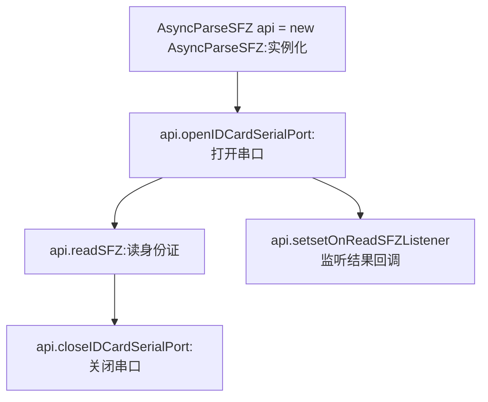

### 1. 身份证开发包说明

   1.1 支持读中国大陆的二代身份证和三带身份证;

   1.2 身份证功能占用了/dev/ttyHSL1串口，波特率115200,需要依赖[串口开发包](https://coding.net/u/CoreWise/p/SDK/git);

   1.3 身份证开发包兼容机器请查看: [身份证开发包兼容机器说明](https://coding.net/u/CoreWise/p/SDK/git)

   1.4 [身份证开发包下载地址](https://coding.net/u/CoreWise/p/SDK/git)

### 2. 二次开发说明

#### 2.1 Android Studio工程配置说明

- 1.添加开发包aar到项目libs目录下
- 2.配置Moudle的build.gradle,参考如下:
```
...
 android {
     ...
     defaultConfig {
         ...
         targetSdkVersion 22 //身份证功能必须降22，其他无所谓
         ...
     }
     ...
 }
 //2.必须2
 repositories {
     flatDir {
         dirs 'libs'   // aar目录
     }
 }

 dependencies {
     ...
    //串口开发包
    //SerialPort SDK
    compile(name: 'serialport_sdk_20190429', ext: 'aar')

    //身份证开发包,需要依赖串口开发包
    //IDcard SDK,need SerialPort SDK
    compile(name: 'idcard_sdk_20190429', ext: 'aar')

 }
```

#### 2.2  接口说明

身份证类: AsyncParseSFZ

|API接口|接口说明
|-----|----
|AsyncParseSFZ(getMainLooper(), Context);|构造函数
|openIDCardSerialPort()|打开身份证串口
|closeIDCardSerialPort()|关闭身份证串口
|readSFZ()|读身份证
|setOnReadSFZListener(OnReadSFZListener)|读身份证结果监听回调

具体说明:

- AsyncParseSFZ()

- openIDCardSerialPort()
- readSFZ()
- setOnReadSFZListener(OnReadSFZListener)
- closeIDCardSerialPort()

#### 2.3 接口调用流程




#### 2.4 接口调用案例

```java
import com.cw.demo.utils.BaseUtils;
import com.cw.demo.R;
import com.cw.idcardsdk.AsyncParseSFZ;
import com.cw.idcardsdk.ParseSFZAPI;
import com.cw.serialportsdk.CoreWise;
import com.cw.serialportsdk.utils.DataUtils;

import android_serialport_api.SerialPortManager;

public class IDCardActivity extends AppCompatActivity {

    @SuppressLint("WrongConstant")
    @Override
    protected void onCreate(Bundle savedInstanceState) {
        super.onCreate(savedInstanceState);
  
       	//1.第一步：实例化
        asyncParseSFZ = new AsyncParseSFZ(getMainLooper(), this);
		//2.第二步：设置读卡监听回调接口,
        //该读卡回调接口需要在合适的地方调用        asyncParseSFZ.readSFZ();  
        asyncParseSFZ.setOnReadSFZListener(new AsyncParseSFZ.OnReadSFZListener() {
            @Override
            public void onReadSuccess(ParseSFZAPI.People people) {
                 //读卡成功
            }
            @Override
            public void onReadFail(int confirmationCode) {
				//读卡失败
            }
        });
    }
    @Override
    protected void onResume() {
        super.onResume();
        //2.打开身份证串口
        asyncParseSFZ.openIDCardSerialPort();
    }
    @Override
    protected void onPause() {
        super.onPause();
        //最后一步：关闭身份证串口
        asyncParseSFZ.closeIDCardSerialPort(); 
    }
}


```

